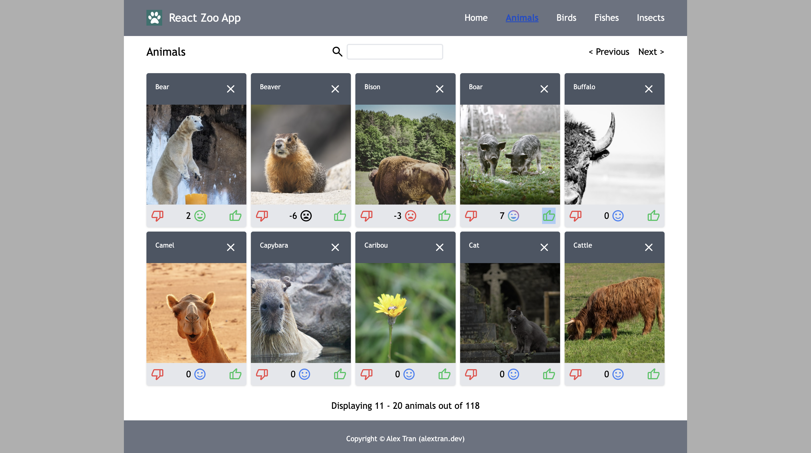
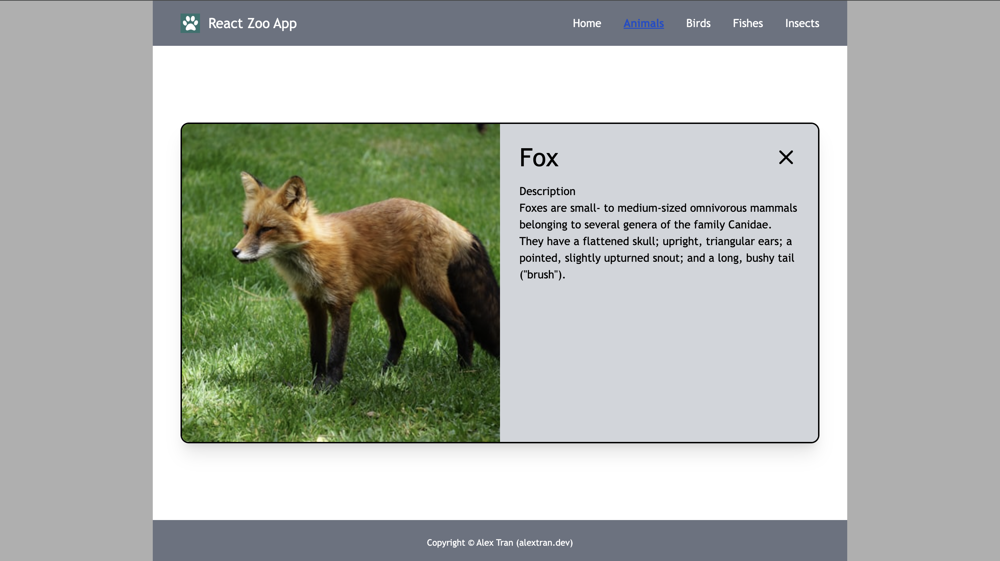

# React Zoo App

This is a A zoo site to display various animals filtered into 4 categories. Visitor can search for animals, mark favourites, give likes, etc.

## Functions:
- Display various animals from json file, unsplash api and wiki api
- Filter animal as 4 categories
- Fetch a random image for each animal from unsplash and pexel api
- Placeholder image when loading image from api
- Search function
- Debounce for search input
- Give likes to animal, and view number of likes
- Hide any animal that you dont like

## Technologies used

Languages:

- Javascript
- CSS
- HTML

Libraries and frameworks:

- React
- [Vite](https://vitejs.dev/)
- [Tailwind](https://tailwindcss.com/)
- [Axios](https://github.com/axios/axios)
- [Router-dom](https://www.npmjs.com/package/react-router-dom)
- Rest APIs

## Setup and usage

Cloning
- ```git clone https://github.com/alextrandev/react_animals.git``` to clone
- ```cd react_animals``` change working directory
- ```npm install``` to install dependencies
- ```npm run dev``` to serve project in local host

Live page [here](https://github.com/margittennosaar/markdown_study_materials)

## Screenshot
**Homepage**


**Category page**


**Single animnal page**


## Sources 

- [Unsplash API](https://unsplash.com/developers)
- [Pexel API / Library](https://github.com/pexels/pexels-javascript.git)
- [Wikipedia API](https://www.mediawiki.org/wiki/API)

## Authors and acknowledgment

Mentor
- [Margit tennosaar](https://github.com/margittennosaar)